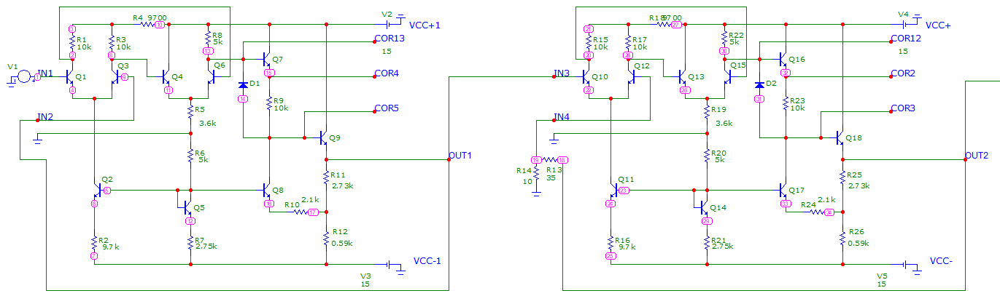
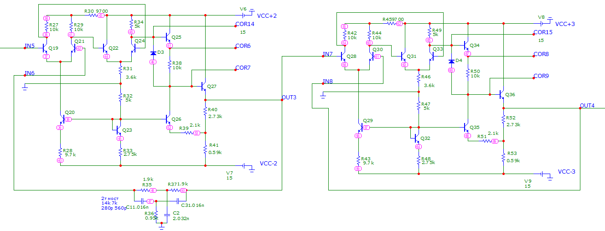
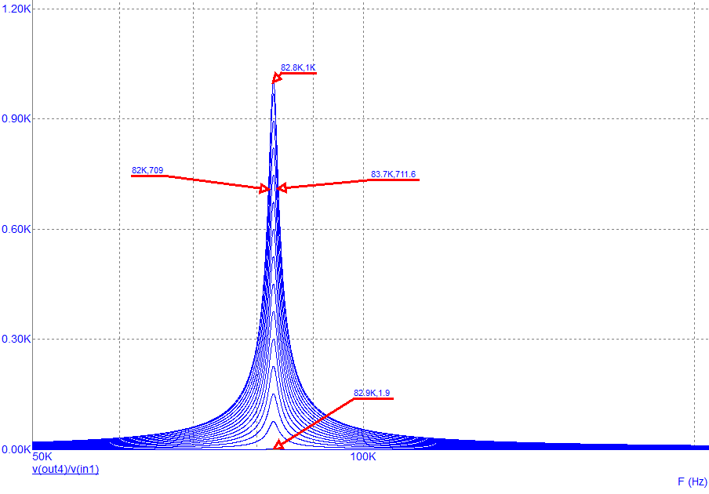
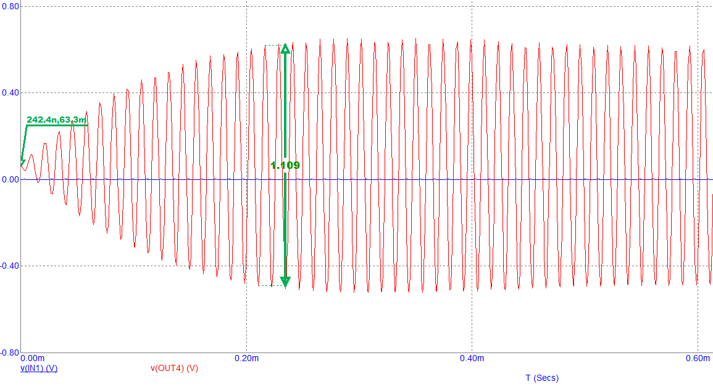

**Разработка электрической схемы и расчет параметров усилителя с заданными характеристиками**  
Задача работы заключалась в том, чтобы понять устройство работы операционных усилителей на примере К140УД1, научиться рассчитывать параметры цепи: токи, потенциалы, мощность, кпд, температурную стабильность. Также получить опыт разработки схем в программе Micro-Cap.  
  
Итоговая схема:

И ее продолжение

Полученные графики:  
АЧХ для разных коэффициентов усилений при помощи R73 от 100 до 54 кОм с шагом в 4 кОм

Осцилограмма усилителя

Схема усилителя, состояла из четырех операционных усилителей, где каждый отвечает за свою функцию. Первый – пустой ОС для большого входного сопротивления. Второй - с частотно-независимой ОС, чтобы регулировать коэффициент усиления. Третий – имеет 2т мост на ОС для нужной полосы пропускания. И последний четвертый – тоже как первый, но только для маленького выходного сопротивления.  
Остальную необходимую информацию можно узнать в приложенных файлах.

*Ниже представлены данные для моего усилителя мощности*  

| Параметр | Значение |
|----------|----------|
| Напряжение питания | 15 В |
| Коэффициент усиления по напряжению | 1-1000 |
| Напряжение смещения 0, не более | 0,1 В |
| Входное дифференциальное сопротивление усилителя | >80 кОм |
| Выходное дифференциальное сопротивление усилителя | <100 Ом |
| Рабочий частотный диапазон | 80-85 кГц |
| Коэффициент ослабления синфазного сигнала | 100 дБ |
| Максимальная суммарная мощность потребления | 0,3 Вт |
| Температурная стабильность при ΔТ=20⁰С | менее 1% |
| Сопротивление нагрузки Rн | 100 Ом |  

*SPICE-параметры транзистора* 
| Параметр | Значение |
|----------|----------|
| **Биполярный транзистор** | |
| Коэффициент усиления прямого тока (BF) | 200 |
| Коэффициент усиления обратного тока (BR) | 0,05 |
| Сопротивление коллектора (RC) | 150 Ом |
| Сопротивление базы (RB) | 150 Ом |
| Сопротивление эмиттера (RE) | 2 Ом |
| Ёмкость перехода эмиттер-база (CJE) | 5,75 фФ |
| Ёмкость перехода коллектор-база (CJC) | 23 фФ |
| Время прямого пролёта (TF) | 23 фс |
| **Диод** | |
| Ток насыщения (IS) | 5×10⁻¹⁸ A |
| Последовательное сопротивление (RS) | 1 Ом |
| Ёмкость перехода (CJO) | 1 фФ |  
